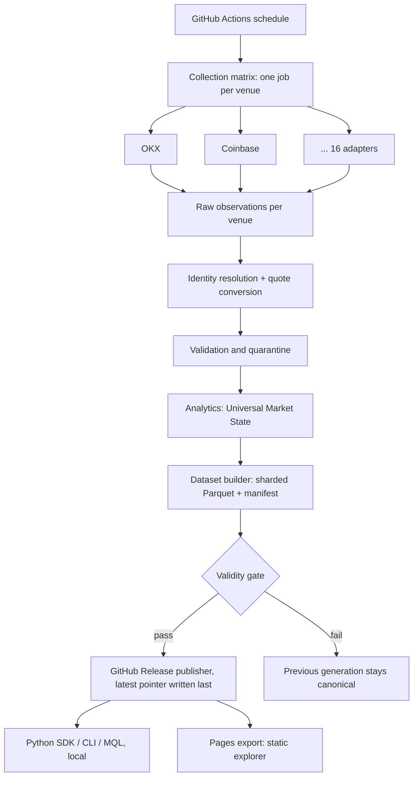

# Vizanix Atlas

**The semantic layer for global crypto markets.**

Crypto trades on hundreds of venues that disagree about symbols, quote currencies, contract sizes, funding intervals and what "24h volume" means. Atlas turns those fragmented public observations into one reproducible market-state object per asset, and shows coverage, quality and provenance next to every number.

```python
from vizanix_atlas import Atlas

atlas = Atlas.latest()

btc = atlas.asset("BTC")
btc.reference_price           # robust cross-venue estimate, not one exchange's last trade
btc.venue_count               # venues that contributed
btc.state().volume            # reported volume, spot and perpetual kept apart
btc.raw()                     # every published field for the asset
```

Exchanges provide events. Atlas provides market state.

[](https://github.com/Vizanix/Atlas/actions/workflows/ci.yml)
[](LICENSE)


> **Status: 0.x, alpha.** The pipeline runs end to end against 16 live public venue APIs. Several headline ideas (liquidity surface, market genome, similarity search, historical percentiles) are designed but **not yet collected or computed**; see [What works today](#what-works-today) and the [roadmap](docs/ROADMAP.md). Nothing here is investment advice: read the [disclaimer](DISCLAIMER.md).

## What is Atlas

Atlas is not another exchange wrapper, price API or indicator library. It defines what a *global market state* is and computes it:

- **Universal Asset Graph.** A canonical asset is a cross-venue object. Identity resolution is deliberately conservative: two tokens sharing a ticker are kept apart unless evidence (contract address, chain, curated override) says they are one asset.
- **Universal Market State.** One typed object per asset: reference price, volume, dispersion, derivatives, coverage, quality and provenance.
- **Quote-currency honesty.** USDT, USDC and USD are never assumed equal. Conversions come from observed rates, and USD figures are left empty when no conversion is observable.
- **Explainable numbers.** The reference price is a capped, volume-weighted robust median. Every venue row shows its price, weight, and, if excluded, why.
- **Market Query Language (MQL).** A small, controlled query language that runs *locally* over downloaded Parquet files.
- **GitHub-native.** Collection, aggregation, publication and the website run on GitHub Actions, Releases and Pages. No server, database or API key.

## What works today

| | Status |
|---|---|
| 16 public venue adapters (spot, perpetual, dated futures, options), fixture-tested | Working |
| Bulk instrument and ticker discovery, ~21,800 instruments in one ~10 s run | Working |
| Conservative asset resolution, quote-conversion graph, validation and quarantine | Working |
| Reference price, dispersion, reported volume, funding (8h-normalised), open interest, basis | Working (where venues supply inputs) |
| Sharded Parquet dataset, manifest, checksums, validity gate, last-known-good publication | Working |
| Python SDK with lazy, checksum-verified downloads; `atlas` CLI; MQL | Working |
| Static website (assets, market, scanner, exchanges, methodology, dataset) | Working |
| Scheduled workflows: collect, daily compaction, housekeeping, Pages, CodeQL | Written; first scheduled runs pending ([bootstrap](docs/OPERATIONS.md#bootstrap)) |
| Order-book liquidity (depth, impact estimates), liquidity surface | Library code and tests exist; **not collected in scheduled runs yet** |
| Historical metrics (changes, percentiles, volatility), crowding, market genome, similarity | Designed; **need accumulated history**, empty until then |
| Bybit, BitMEX, Binance derivatives | **Disabled**, with documented reasons ([exchanges](docs/DATA_SOURCES.md)) |

Windowed metrics start empty and warm up as snapshots accumulate. Atlas never fabricates history, and a missed scheduled run is recorded as a gap, never filled in.

## Install

```bash
git clone https://github.com/Vizanix/Atlas && cd Atlas
python -m venv .venv && source .venv/bin/activate
pip install -e ".[dev]"
atlas --help
pytest
```

Python 3.11+. No Docker, no credentials.

## Quick start

Collect a few venues locally and build a dataset. This is the same code path the scheduled workflow runs:

```bash
for v in okx coinbase kraken bitstamp bitget; do
  atlas collect --exchange $v --output .local-data/collected
done
atlas build-dataset --input .local-data/collected --output .local-data/dataset
atlas verify .local-data/dataset

atlas status --source .local-data/dataset
atlas asset BTC --source .local-data/dataset
atlas market --source .local-data/dataset
```

(`build-dataset` refuses to publish from fewer than four successful venues, by design; see [quality](docs/QUALITY.md).)

## Market Query Language

MQL compiles to parameterised DuckDB SQL and runs on your machine against downloaded Parquet. It is not SQL passthrough: no functions, joins, files or network.

```sql
SELECT asset, reference_price, venue_count, price_dispersion_bps, reported_volume_24h_usd
FROM market
WHERE venue_count >= 8 AND reported_volume_24h_usd > 10000000
ORDER BY price_dispersion_bps DESC
LIMIT 20;
```

```bash
atlas query "SELECT asset, venue_count FROM market ORDER BY venue_count DESC LIMIT 10"
```

Only metrics with data behind them are selectable; history-based functions arrive with the history ([MQL reference](docs/MQL.md)).

## CLI

`status` · `asset` · `search` · `market` · `query` · `exchanges` · `methodology` · `verify` · `collect` · `aggregate` · `build-dataset` · `publish-github` · `compact-day` · `housekeeping` · `export-web`. Every read command accepts `--source` (a local path or generation ID) and most accept `--json`.

## Architecture



Failure is normal: one venue failing produces a degraded generation, not a failed one. A generation that fails validation never replaces the last known good one. Details: [architecture](docs/ARCHITECTURE.md), [GitHub design](docs/GITHUB_ARCHITECTURE.md), [storage](docs/STORAGE.md).

## Data freshness and honesty

- Snapshots are **scheduled (every 15 minutes, best effort), not real time**. GitHub can delay scheduled runs; delays and gaps are recorded.
- Volume is **reported by venues** and not independently verified.
- Public endpoints only. No private data, no account access, no authentication, no bypassing of blocks: a venue that blocks GitHub runners is reported as unavailable, not worked around.
- Read [limitations](docs/LIMITATIONS.md) before relying on any number.

## Documentation

[Architecture](docs/ARCHITECTURE.md) · [Specification](docs/SPECIFICATION.md) · [Methodology](docs/METHODOLOGY.md) · [Metric dictionary](docs/METRICS.md) · [Market state](docs/MARKET_STATE.md) · [MQL](docs/MQL.md) · [Data model](docs/DATA_MODEL.md) · [Asset resolution](docs/ASSET_RESOLUTION.md) · [Quality](docs/QUALITY.md) · [Exchange adapters](docs/EXCHANGE_ADAPTERS.md) · [Data sources](docs/DATA_SOURCES.md) · [Data policy](docs/DATA_POLICY.md) · [Operations](docs/OPERATIONS.md) · [Benchmarks](docs/BENCHMARKS.md) · [Roadmap](docs/ROADMAP.md) · [Limitations](docs/LIMITATIONS.md)

## Contributing and security

Adding a venue, a metric or an identity mapping has a checklist: [CONTRIBUTING.md](CONTRIBUTING.md). Report vulnerabilities per [SECURITY.md](SECURITY.md). Community expectations: [CODE_OF_CONDUCT.md](CODE_OF_CONDUCT.md).

## License

Code: [Apache-2.0](LICENSE). **A code license is not a data license.** Venue-derived data is governed by each venue's terms; see the [data policy](docs/DATA_POLICY.md).

## Disclaimer

Research and infrastructure tooling, not investment advice. [DISCLAIMER.md](DISCLAIMER.md).

---

Maintained by [Vizanix](https://github.com/Vizanix), which builds algorithmic trading infrastructure: exchange integrations, execution and market-data systems, and quantitative tooling.
