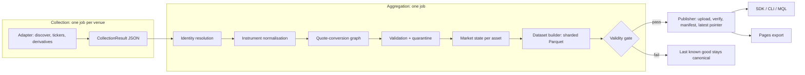

# Architecture

Atlas is a pipeline from untrusted public exchange payloads to a reproducible, versioned dataset, plus clients that read that dataset. Every stage has a typed input and output, and every stage can fail without failing its neighbours.

## Layers (`src/vizanix_atlas/`)

| Package | Responsibility |
|---|---|
| `core` | Config, typed errors, time, identifiers, numeric parsing, rate limiting, HTTP client, metric registry, versions |
| `models` | Pydantic v2 schema: venues, assets, instruments, observations, state, quality, manifests |
| `adapters` | One module per venue behind the `ExchangeAdapter` contract; no venue-specific field escapes it |
| `discovery` | Collection runtime (never raises for venue-side problems), tier selection, and the aggregation pipeline |
| `identity` | Evidence-based asset resolution |
| `normalization` | Instrument normalisation and the quote-conversion graph |
| `quality` | Observation validation and quarantine |
| `analytics` | Pure functions: robust statistics, reference price, volume, derivatives, liquidity, structure, universes, state assembly |
| `storage` | Flattening, Parquet tables, writer, dataset builder, compaction, housekeeping |
| `publishing` | Manifests, validity gate, `Publisher` protocol (filesystem and GitHub Releases), daily compaction, retention candidates, web export |
| `mql` | Lexer, parser, semantic validation, compiler, engine |
| `sdk` | `Atlas` client, lazy checksum-verified datasets, downloader, cache, views |
| `cli` | The `atlas` command |

## Boundaries that matter

- **Adapter boundary.** Adapters translate a venue's JSON into `Raw*` models in normalised units and UTC. Nothing downstream knows venue field names. Adapters call only public endpoints, through `ExchangeHttpClient` (timeouts, body-size cap, JSON-depth cap, token-bucket rate limiting, retry with backoff and jitter, per-run circuit breaker).
- **Analytics is pure.** `build_market_state` is a function of its inputs (no I/O, no clock, no randomness), so a generation is reproducible from frozen observations.
- **Storage is not GitHub.** Analytics never imports GitHub code. `Publisher` is a protocol; `FilesystemPublisher` serves local development and tests, `GitHubReleasePublisher` serves production. The publish *sequence* lives in `publishing/publish.py`, independent of backend.
- **The adapter is not the product.** Adapter count is not the goal; correct normalisation and semantics are. A venue that cannot be verified is disabled with a reason rather than shipped half-working.

## Collection tiers

- **Tier A (universal):** every active instrument on every enabled venue from bulk endpoints (never one request per symbol): metadata, quote, 24h volume, and mark/index/funding/open interest where bulk. Enforced by a per-venue request ceiling.
- **Tier B (liquidity):** deterministic order-book sampling for a selected liquid universe. Selection logic and analytics exist; scheduled collection does not use them yet.
- **Tier C (advanced):** deeper books and options for high-information markets. Option instruments are ingested from Deribit and OKX.

Each state exposes the tier reached.

## Failure behaviour

| Event | Outcome |
|---|---|
| One venue times out, errors, or changes schema | Its result records the failure; the generation is degraded, not failed |
| A venue is blocked from the runner network | `unavailable_from_collector_network`; no workaround |
| Too few venues succeed, or counts collapse vs the previous generation | Not published; previous generation stays `latest` |
| Aggregation bug produces bad output | Validity gate refuses it; previous stays `latest` |
| Upload fails mid-way | `latest` pointer was never advanced; generation is invisible to clients |
| Same slot runs twice | Uploads replace same-named assets; compaction records duplicates and does not double-count |

## Determinism

No unseeded randomness. Inputs are sorted before aggregation; ties break on stable keys; shard assignment is `sha256(asset_id)` (first 8 bytes) `mod shard_count`, identical in every client.
